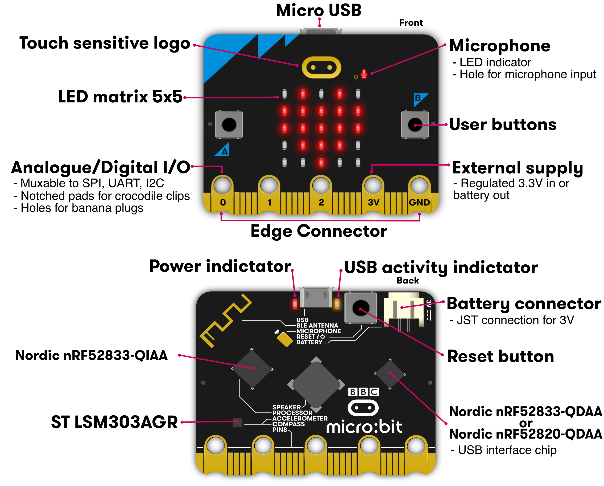
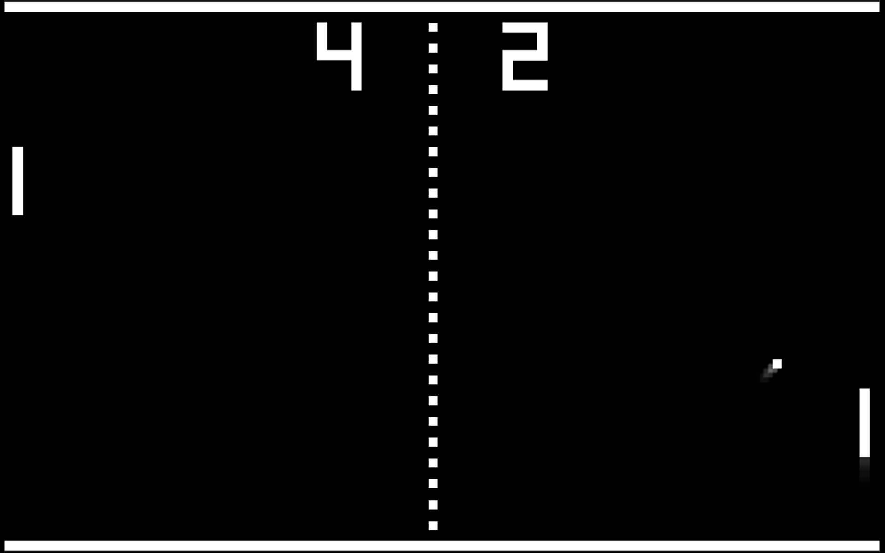

# Micro:bit Basics

## Setup
The easiest way to get started is to use the online tool from Microsoft [https://makecode.microbit.org/](https://makecode.microbit.org/){target="_blank"} and try any of the Tutorials for the new micro:bit (v2). You can also find code below the demonstrates most of the sensors and features of the micro:bit.

## Hardware


## Sensors and Features

### LED Display
You can display messages and icons on the 5x5 display LEDS. 

=== "Python"

    ``` python
    def on_forever():
        basic.show_string("Hello!")
    basic.forever(on_forever)
    ```

=== "Javascript"

    ``` javascript
    basic.forever(function on_forever() {
        basic.showString("Hello!")
    })
    ```

!!! question
    Change the display to show an icon.

### Temperature Sensor

=== "Python"

    ``` python 
    def on_forever():
        if input.temperature() > 25:
            basic.show_icon(IconNames.SAD)
        else:
            basic.show_icon(IconNames.HAPPY)
    basic.forever(on_forever)
    ```

=== "Javascript"
    ``` javascript
    basic.forever(function () {
        if (input.temperature() > 25) {
            basic.showIcon(IconNames.Sad)
        } else {
            basic.showIcon(IconNames.Happy)
        }
    })
    ```

!!! question 
    Can you make it play music when the temperature is at a comfortable level?

### Light Level

=== "Python"
    ```python
    light_level = 0

    def on_forever():
        global light_level
        light_level = input.light_level()
        if light_level > 100:
            basic.show_icon(IconNames.GHOST)
        else:
            basic.show_icon(IconNames.ANGRY)
    basic.forever(on_forever)    
    ```

=== "Javascript"
    ``` javascript
    let light_level = 0
    basic.forever(function on_forever() {
        
        light_level = input.lightLevel()
        if (light_level > 100) {
            basic.showIcon(IconNames.Ghost)
        } else {
            basic.showIcon(IconNames.Angry)
        }
        
    })
    ```

### Buttons

Pong was one of the first computer games you could play at home. This version you can play on the micro:bit against yourself.


=== "Python"
    ``` python
    bar_x = 0
    point = 0
    interval = 0
    interval_step = 0
    ball_x = 0
    ball_y = 0
    ball_dx = 0
    ball_dy = 0
    in_game = False

    # Move the bar left
    def on_button_pressed_a():
        global bar_x
        if bar_x > 0:
            led.unplot(bar_x + 1, 4)
            bar_x = bar_x - 1
            led.plot(bar_x, 4)
    input.on_button_pressed(Button.A, on_button_pressed_a)

    # Move the bar right
    def on_button_pressed_b():
        global bar_x
        if bar_x < 3:
            led.unplot(bar_x, 4)
            bar_x = bar_x + 1
            led.plot(bar_x + 1, 4)
    input.on_button_pressed(Button.B, on_button_pressed_b)

    def on_forever():
        global point, interval, interval_step, ball_x, ball_y, ball_dx, ball_dy, bar_x, in_game
        point = 0
        interval = 500
        interval_step = 10
        ball_x = 3
        ball_y = 4
        ball_dx = -1
        ball_dy = -1
        bar_x = 0
        basic.show_string("GO!")
        led.plot(ball_x, ball_y)
        led.plot(bar_x, 4)
        led.plot(bar_x + 1, 4)
        in_game = True
        while in_game:
            if ball_x + ball_dx > 4:
                ball_dx = ball_dx * -1
            elif ball_x + ball_dx < 0:
                ball_dx = ball_dx * -1
            if ball_y + ball_dy < 0:
                ball_dy = ball_dy * -1
            elif ball_y + ball_dy > 3:
                if led.point(ball_x + ball_dx, ball_y + ball_dy):
                    ball_dy = ball_dy * -1
                    point = point + 1
                    if interval - interval_step >= 0:
                        interval = interval - interval_step
                else:
                    in_game = False
            if in_game:
                led.plot(ball_x + ball_dx, ball_y + ball_dy)
                led.unplot(ball_x, ball_y)
                ball_x = ball_x + ball_dx
                ball_y = ball_y + ball_dy
                basic.pause(interval)
            else:
                game.set_score(point)
                game.game_over()
    basic.forever(on_forever)
    ```

=== "Javascript"
    ```javascript
    let bar_x = 0
    let point = 0
    let interval = 0
    let interval_step = 0
    let ball_x = 0
    let ball_y = 0
    let ball_dx = 0
    let ball_dy = 0
    let in_game = false

    //  Move the bar left
    input.onButtonPressed(Button.A, function on_button_pressed_a() {
        
        if (bar_x > 0) {
            led.unplot(bar_x + 1, 4)
            bar_x = bar_x - 1
            led.plot(bar_x, 4)
        }
        
    })

    //  Move the bar right
    input.onButtonPressed(Button.B, function on_button_pressed_b() {
        
        if (bar_x < 3) {
            led.unplot(bar_x, 4)
            bar_x = bar_x + 1
            led.plot(bar_x + 1, 4)
        }
        
    })

    basic.forever(function on_forever() {
        
        point = 0
        interval = 500
        interval_step = 10
        ball_x = 3
        ball_y = 4
        ball_dx = -1
        ball_dy = -1
        bar_x = 0
        basic.showString("GO!")
        led.plot(ball_x, ball_y)
        led.plot(bar_x, 4)
        led.plot(bar_x + 1, 4)
        in_game = true
        while (in_game) {
            if (ball_x + ball_dx > 4) {
                ball_dx = ball_dx * -1
            } else if (ball_x + ball_dx < 0) {
                ball_dx = ball_dx * -1
            }
            
            if (ball_y + ball_dy < 0) {
                ball_dy = ball_dy * -1
            } else if (ball_y + ball_dy > 3) {
                if (led.point(ball_x + ball_dx, ball_y + ball_dy)) {
                    ball_dy = ball_dy * -1
                    point = point + 1
                    if (interval - interval_step >= 0) {
                        interval = interval - interval_step
                    }
                    
                } else {
                    in_game = false
                }
                
            }
            
            if (in_game) {
                led.plot(ball_x + ball_dx, ball_y + ball_dy)
                led.unplot(ball_x, ball_y)
                ball_x = ball_x + ball_dx
                ball_y = ball_y + ball_dy
                basic.pause(interval)
            } else {
                game.setScore(point)
                game.gameOver()
            }
            
        }
    })
    ```

### Network
Battleship is another classic game that you can play using 2 micro:bits

=== "Python"
    ``` python
    hit_x = 0
    hit_y = 0
    index = 0
    position_y = 0
    position_x = 0
    my_battle_area: List[number] = []
    hit_count = 0
    fire_y = 0
    fire_x = 0
    # change this number and share it with the person you will play with
    radio.set_group(123)
    fire_x = 0
    fire_y = 1
    hit_count = 0
    my_battle_area = []

    # setup the board
    for index2 in range(25):
        my_battle_area.append(0)
    number_of_ships = 5
    while number_of_ships > 0:
        position_x = randint(0, 4)
        position_y = 1 + randint(0, 3)
        index = position_x + 5 * position_y
        if my_battle_area[index] == 0:
            my_battle_area[index] = 1
            led.plot(position_x, position_y)
            number_of_ships += 0 - 1

    # set the y-axis for the cannon
    def on_button_pressed_b():
        global fire_y
        fire_y = (fire_y + 1) % 5
        if fire_y == 0:
            fire_y = 1
    input.on_button_pressed(Button.B, on_button_pressed_b)

    # set the x-axis for the cannon
    def on_button_pressed_a():
        global fire_x
        fire_x = (fire_x + 1) % 5
    input.on_button_pressed(Button.A, on_button_pressed_a)

    # fire the cannon
    def on_button_pressed_ab():
        global fire_x, fire_y
        radio.send_number(fire_x + 5 * fire_y)
        fire_x = 0
        fire_y = 1
    input.on_button_pressed(Button.AB, on_button_pressed_ab)

    # receive the cannon fire
    def on_received_number(receivedNumber):
        global hit_y, hit_x, hit_count
        if receivedNumber >= 0:
            if my_battle_area[receivedNumber] == 1:
                my_battle_area[receivedNumber] = 0
                hit_y = Math.floor(receivedNumber / 5)
                hit_x = receivedNumber - 5 * hit_y
                led.unplot(hit_x, hit_y)
                radio.send_number(-1)
            else:
                radio.send_number(-2)
        elif receivedNumber == -1:
            hit_count += 1
            led.plot(0, 0)
            led.unplot(4, 0)
            if hit_count == 5:
                basic.clear_screen()
                while True:
                    basic.show_string("You win!")
        elif receivedNumber == -2:
            led.plot(4, 0)
            led.unplot(0, 0)
    radio.on_received_number(on_received_number)
    ```

=== "Javascript"
    ``` javascript

    // receive the cannon fire
    radio.onReceivedNumber(function on_received_number(receivedNumber: number) {
        
        if (receivedNumber >= 0) {
            if (my_battle_area[receivedNumber] == 1) {
                my_battle_area[receivedNumber] = 0
                hit_y = Math.floor(receivedNumber / 5)
                hit_x = receivedNumber - 5 * hit_y
                led.unplot(hit_x, hit_y)
                radio.sendNumber(-1)
            } else {
                radio.sendNumber(-2)
            }
            
        } else if (receivedNumber == -1) {
            hit_count += 1
            led.plot(0, 0)
            led.unplot(4, 0)
            if (hit_count == 5) {
                basic.clearScreen()
                while (true) {
                    basic.showString("You win!")
                }
            }
            
        } else if (receivedNumber == -2) {
            led.plot(4, 0)
            led.unplot(0, 0)
        }
        
    })

    // set the x-axis for the cannon
    input.onButtonPressed(Button.A, function on_button_pressed_a() {
        
        fire_x = (fire_x + 1) % 5
    })

    // fire the cannon
    input.onButtonPressed(Button.AB, function on_button_pressed_ab() {
        
        radio.sendNumber(fire_x + 5 * fire_y)
        fire_x = 0
        fire_y = 1
    })

    // set the y-axis for the cannon
    input.onButtonPressed(Button.B, function on_button_pressed_b() {
        
        fire_y = (fire_y + 1) % 5
        if (fire_y == 0) {
            fire_y = 1
        }
        
    })

    // init variables
    let hit_x = 0
    let hit_y = 0
    let index = 0
    let position_y = 0
    let position_x = 0
    let my_battle_area : number[] = []
    let hit_count = 0
    let fire_y = 0
    let fire_x = 0

    // change this number and share it with the person you will play with
    radio.setGroup(123)
    fire_x = 0
    fire_y = 1
    hit_count = 0
    my_battle_area = []

    // setup the board
    for (let index2 = 0; index2 < 25; index2++) {
        my_battle_area.push(0)
    }
    let number_of_ships = 5
    while (number_of_ships > 0) {
        position_x = randint(0, 4)
        position_y = 1 + randint(0, 3)
        index = position_x + 5 * position_y
        if (my_battle_area[index] == 0) {
            my_battle_area[index] = 1
            led.plot(position_x, position_y)
            number_of_ships += 0 - 1
        }
        
    }
    ```

!!! question 
    Will this work if one person writes their code in python and the other in javascript?
